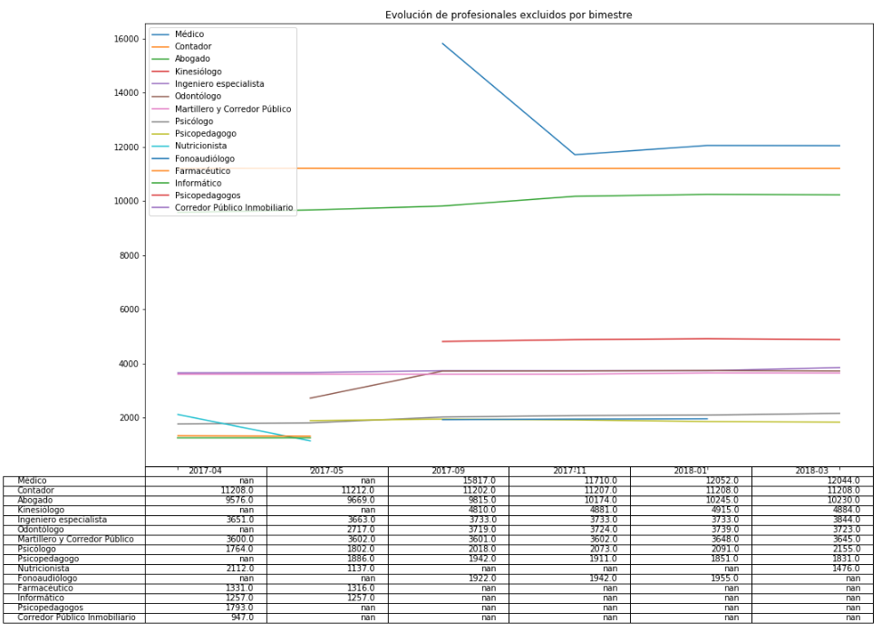

# Profesionales excluidos Municipalidad de Córdoba

Análisis sobre la serie de datos de _profesionales excluidos_ de la Ciudad de Córdoba.  

Sobre [datos](https://gobiernoabierto.cordoba.gob.ar/data/datos-abiertos/categoria/exenciones/profesionales-excluidos/197) de la Municipalidad de Córdoba.  

Documentación relacionada:  
[Resolución Profesionales Exentos 06-17](https://gobiernoabierto.cordoba.gob.ar/media/cdn/Resoluci%C3%B3n_General_06-17_-_Exenciones_de_profesionales.pdf).  
[Resolución Prórroga 11-17](https://gobiernoabierto.cordoba.gob.ar/media/cdn/Resoluci%C3%B3n_General_11-17_-_Pr%C3%B3rroga_profesionales.pdf).  

### Aclaraciones
 - Aún falta la entrega de datos de algunos colegios profesionales
 - La obligatoriedad de matriculación y las normas son diferentes en cada profesión por lo que la lista publicada podría no incluir a todos los profesionales existentes.

**Importante**
La publicación de la Nómina de Profesionales Excluidos ha sido discontinuada, de acuerdo a lo dispuesto por la [Resolución General 11/18](https://www.cordoba.gob.ar/wp-content/uploads/2018/04/rg-11-2018-profesionales.pdf).  
